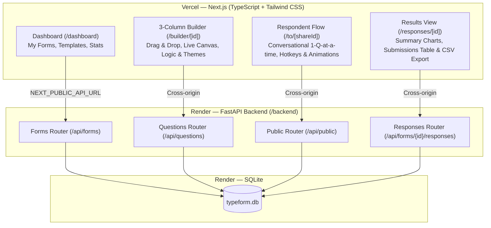
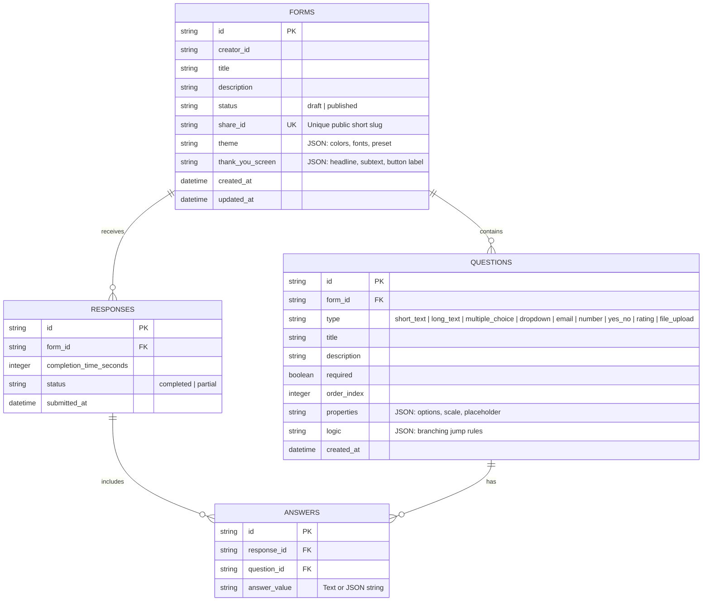

# Typeform Clone - Fullstack Assignment

A high-fidelity, functional clone of **Typeform** replicating Typeform's signature design system, 3-column form builder, 1-question-at-a-time conversational respondent experience, logic branching, theme customizer, response analytics, and CSV export.


---

## Live Demo

| Service | URL |
|---------|-----|
| **Frontend** | [https://type-form-pearl.vercel.app](https://type-form-pearl.vercel.app) |
| **Backend API** | [https://typeform-8dss.onrender.com](https://typeform-8dss.onrender.com) |

> **⚠️ First-time setup**: After opening the dashboard, click the **"Reset Demo Data"** button in the top bar to seed sample forms with pre-filled responses. The Render free-tier database is ephemeral and resets on each deployment.

---

## Technical Stack

### Frontend
- **Framework**: Next.js 15 (App Router, TypeScript)
- **UI Components**: shadcn/ui (Dialog, Tabs, Switch, Card, Progress, Badge, Button, Input, Textarea)
- **Styling**: Tailwind CSS with custom Typeform color palettes & design tokens
- **Animations**: Framer Motion (vertical slide-up/down transitions, smooth fades)
- **Drag-and-Drop**: `@dnd-kit/core` & `@dnd-kit/sortable` (for question reordering)
- **Icons**: Lucide React
- **Authentication**: Clerk Auth (`@clerk/nextjs`) for Creator Auth
- **Visual Analytics**: Recharts
- **Celebration Effects**: `canvas-confetti`

### Backend
- **Framework**: Python 3.12+ with **FastAPI**
- **ORM**: SQLAlchemy 2.0+
- **Data Validation**: Pydantic v2
- **Database**: SQLite (`typeform.db`)
- **Server**: Uvicorn
- **Rate Limiting**: SlowAPI

---

## System Architecture



---

## Database Schema



---

## Key Features

1. **Workspace Dashboard (`/dashboard`)**:
   - Creator forms list with status badges (`Draft` / `Published`), total response counter, search bar, duplicate, delete, and publish toggles.
   - One-click **Reset Demo Data** button that re-seeds the database with pre-built realistic forms and responses.
   - Template gallery with 4 pre-built templates (Feedback, Hiring, Events, Leads).
   - Sidebar navigation with light/dark theme toggle.

2. **3-Column Typeform Builder (`/builder/[id]`)**:
   - **Left Panel**: Question list with drag-and-drop handles (`@dnd-kit`), type badges, and `+ Add Question` popover featuring 9 question types.
   - **Middle Canvas**: Live interactive view displaying questions as respondents will see them, with direct inline editing of titles, help text, and options.
   - **Right Inspector**:
     - *Question Settings*: Required toggle switch, help text, rating scale max (1-5 or 1-10).
     - *Logic Jumps*: Conditional branching rule builder (`IF Answer IS "Yes", THEN JUMP TO Q4`).
     - *Design Theme*: Theme presets (Clean Light, Modern Dark, Warm Sunset, Ocean Blue, Warm White) + Custom Color Pickers.

3. **Signature Respondent Experience (`/to/[shareId]`)**:
   - Fullscreen distraction-free layout with dynamic background theme.
   - **Welcome screen** with form title and description.
   - Conversational **1-question-at-a-time** experience.
   - **Typewriter text animation** on question titles.
   - Framer Motion vertical slide-up/down transitions.
   - **Progress dots** at top of screen.
   - **Keyboard Navigation**:
     - `Enter` / `Ctrl + Enter` to advance
     - `A`, `B`, `C`, `D` letter keys for multiple choice
     - `1`-`5` number keys for ratings
     - `Y` and `N` for Yes/No decisions
     - `Up` and `Down` arrow keys to navigate questions
   - Real-time client & server validation with error shake alerts.
   - Live logic jump evaluation.
   - Submission fireworks burst with `canvas-confetti` + customizable Thank You screen.

4. **Results & Analytics (`/responses/[id]`)**:
   - **Insights Tab**: Total submissions, completion rate, average completion time, and horizontal bar charts for choice/rating questions.
   - **Responses Tab**: Submission table with date, duration, status, and full detail view drawer.
   - **Instant CSV Export**: One-click CSV export download.

---

## API Documentation

| Method | Endpoint | Description |
| :--- | :--- | :--- |
| `GET` | `/api/forms` | List creator forms with response count |
| `POST` | `/api/forms` | Create a new form |
| `GET` | `/api/forms/{id}` | Get form details with questions & theme |
| `PUT` | `/api/forms/{id}` | Update form title, theme, thank-you screen |
| `DELETE` | `/api/forms/{id}` | Delete form |
| `POST` | `/api/forms/{id}/duplicate` | Duplicate form and questions |
| `POST` | `/api/forms/{id}/publish` | Toggle publish status |
| `POST` | `/api/forms/{id}/questions` | Add question |
| `PUT` | `/api/questions/{id}` | Update question properties / logic rules |
| `DELETE` | `/api/questions/{id}` | Delete question |
| `POST` | `/api/forms/{id}/questions/reorder` | Update question order |
| `GET` | `/api/public/forms/{share_id}` | Public form fetch (No auth required) |
| `POST` | `/api/public/forms/{share_id}/responses` | Submit response (No auth required) |
| `GET` | `/api/forms/{id}/responses` | List submitted responses |
| `GET` | `/api/forms/{id}/responses/summary` | Get summary analytics & chart data |
| `GET` | `/api/forms/{id}/responses/export` | Download CSV export of responses |
| `POST` | `/api/seed` | Re-seed database with sample data |

---

## Local Setup & Quick Start

### Prerequisites
- Node.js (v18+) & npm
- Python (v3.10+)

### 1. Backend Setup (`/backend`)

```bash
cd backend
python -m pip install -r requirements.txt
python run.py
```
*The FastAPI server starts on `http://127.0.0.1:8000`. The SQLite database (`typeform.db`) will auto-seed on first launch.*

### 2. Frontend Setup (`/frontend`)

```bash
cd frontend
npm install --legacy-peer-deps
npm run dev
```
*The Next.js web app starts on `http://localhost:3000`.*

### Environment Variables

**Backend** (`backend/.env`):
```env
DATABASE_URL=sqlite:///./typeform.db
SECRET_KEY=your_secret_key_here
CORS_ORIGINS=http://localhost:3000,http://127.0.0.1:3000
PORT=8000
```

**Frontend** (`frontend/.env.local`):
```env
NEXT_PUBLIC_API_URL=http://127.0.0.1:8000/api
NEXT_PUBLIC_CLERK_PUBLISHABLE_KEY=pk_test_your_key_here
CLERK_SECRET_KEY=sk_test_your_secret_here
```

---

## Deployment

### Production Architecture
- **Frontend**: Deployed on [Vercel](https://vercel.com) — automatic CI/CD from `master` branch
- **Backend**: Deployed on [Render](https://render.com) — automatic CI/CD from `master` branch
- **Communication**: Cross-origin via `NEXT_PUBLIC_API_URL` and `CORS_ORIGINS`/`FRONTEND_URL` env vars

### Render (Backend)
Root directory: `backend`
- Build: `pip install -r requirements.txt`
- Start: `uvicorn app.main:app --host 0.0.0.0 --port $PORT`
- Env vars: `CORS_ORIGINS`, `FRONTEND_URL`, `SECRET_KEY`

### Vercel (Frontend)
Root directory: `frontend`
- Framework: Next.js (auto-detected)
- Env var: `NEXT_PUBLIC_API_URL=https://typeform-8dss.onrender.com/api`

Configuration files: `render.yaml` (root), `frontend/vercel.json`

---

## Assumptions & Design Decisions

1. **Creator Authentication**: Clerk Auth is integrated for Creator routes (`/dashboard`, `/builder/[id]`, `/responses/[id]`). All forms share a `default_creator` namespace so demo seed data is visible to any authenticated user. No per-user data isolation.
2. **Public Respondent Flow**: The public form filling URL (`/to/[shareId]`) is completely open and requires no authentication.
3. **Ephemeral Database**: Render's free-tier SQLite database resets on each deployment. Use the **"Reset Demo Data"** button on the dashboard to re-populate sample forms.
4. **File Upload**: The file upload question type stores a placeholder filename only — no persistent file storage is implemented. This is intentional for the demo scope.
5. **No Database Migrations**: Tables are auto-created on startup via SQLAlchemy's `create_all()`. A production system would use Alembic for versioned migrations.
6. **CORS**: Configured via environment variables to allow cross-origin requests between Vercel (frontend) and Render (backend). Falls back to `*` when no origins are configured.
