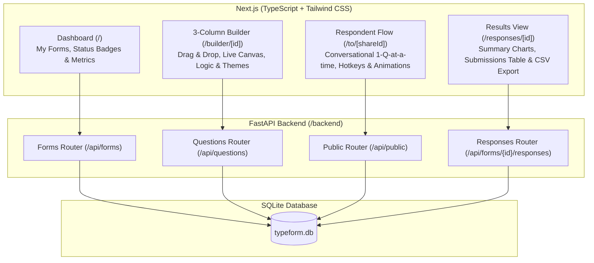

# Typeform Clone - Fullstack Assignment

A high-fidelity, functional clone of **Typeform** replicating Typeform's signature design system, 3-column form builder, 1-question-at-a-time conversational respondent experience, logic branching, theme customizer, response analytics, and CSV export.


---

## Technical Stack

### Frontend
- **Framework**: Next.js 14/15 (App Router, TypeScript)
- **UI Components**: **shadcn/ui** (Dialog, Tabs, Switch, Card, Progress, Badge, Button, Input, Textarea)
- **Styling**: Tailwind CSS with custom Typeform color palettes & design tokens
- **Animations**: Framer Motion (vertical slide-up/down transitions, smooth fades)
- **Drag-and-Drop**: `@dnd-kit/core` & `@dnd-kit/sortable` (for question reordering)
- **Icons**: Lucide React
- **Authentication**: Clerk Auth (`@clerk/nextjs`) for Creator Auth (with automatic local dev fallback)
- **Visual Analytics**: Recharts
- **Celebration Effects**: `canvas-confetti`

### Backend
- **Framework**: Python 3.10+ with **FastAPI**
- **ORM**: SQLAlchemy 2.0+
- **Data Validation**: Pydantic v2
- **Database**: SQLite (`typeform.db`)
- **Server**: Uvicorn

---

## System Architecture



---

## Database Schema

```mermaid
erdiagram
    FORMS ||--o{ QUESTIONS : contains
    FORMS ||--o{ RESPONSES : receives
    RESPONSES ||--o{ ANSWERS : includes
    QUESTIONS ||--o{ ANSWERS : has

    FORMS {
        string id PK
        string creator_id
        string title
        string description
        string status "draft | published"
        string share_id UK "Unique public short slug"
        string theme "JSON: colors, fonts, preset"
        string thank_you_screen "JSON: headline, subtext, button label"
        datetime created_at
        datetime updated_at
    }

    QUESTIONS {
        string id PK
        string form_id FK
        string type "short_text | long_text | multiple_choice | dropdown | email | number | yes_no | rating | file_upload"
        string title
        string description
        boolean required
        integer order_index
        string properties "JSON: options, scale, placeholder"
        string logic "JSON: branching jump rules"
        datetime created_at
    }

    RESPONSES {
        string id PK
        string form_id FK
        integer completion_time_seconds
        string status "completed | partial"
        datetime submitted_at
    }

    ANSWERS {
        string id PK
        string response_id FK
        string question_id FK
        string answer_value "Text or JSON string"
    }
```

---

## Key Features

1. **Workspace Dashboard (`/`)**:
   - Creator forms list with status badges (`Draft` / `Published`), total response counter, search bar, duplicate, delete, and publish toggles.
   - One-click **Reset Demo Data** button that re-seeds the database with pre-built realistic forms and responses.

2. **3-Column Typeform Builder (`/builder/[id]`)**:
   - **Left Panel**: Question list with drag-and-drop handles (`@dnd-kit`), type badges, and `+ Add Question` popover featuring 9 question types.
   - **Middle Canvas**: Live interactive view displaying questions as respondents will see them, with direct inline editing of titles, help text, and options.
   - **Right Inspector**:
     - *Question Settings*: Required toggle switch, help text, rating scale max (1-5 or 1-10).
     - *Logic Jumps*: Conditional branching rule builder (`IF Answer IS "Yes", THEN JUMP TO Q4`).
     - *Design Theme*: Theme presets (Clean Light, Modern Dark, Warm Sunset, Ocean Blue, Neon Violet) + Custom Color Pickers.
     - *Thank You Screen*: Customizable headline, description, and button text.

3. **Signature Respondent Experience (`/to/[shareId]`)**:
   - Fullscreen distraction-free layout with dynamic background theme.
   - Conversational **1-question-at-a-time** experience.
   - Framer Motion vertical slide-up/down transitions.
   - **Keyboard Navigation**:
     - `Enter` / `Ctrl + Enter` to advance
     - `A`, `B`, `C`, `D` letter keys for multiple choice
     - `1`-`5` number keys for ratings
     - `Y` and `N` for Yes/No decisions
     - `Up` and `Down` arrow keys to navigate questions
   - Real-time client & server validation with error shake alerts.
   - Live logic jump evaluation.
   - Submission fireworks burst with `canvas-confetti` + Thank You screen.

4. **Results & Analytics (`/responses/[id]`)**:
   - **Summary Tab**: Total submissions, completion rate, average completion time, and visual bar charts for choice/rating questions.
   - **Responses Table Tab**: Submission table with submission date, duration, status, and full detail view drawer.
   - **Instant CSV Export**: One-click CSV export download.

---

## API Documentation Overview

| Method | Endpoint | Description |
| :--- | :--- | :--- |
| `GET` | `/api/forms` | List creator forms with response count |
| `POST` | `/api/forms` | Create a new form |
| `GET` | `/api/forms/{id}` | Get form details with questions & theme |
| `PUT` | `/api/forms/{id}` | Update form title, theme, thank-you screen |
| `DELETE` | `/api/forms/{id}` | Delete form |
| `POST` | `/api/forms/{id}/duplicate` | Duplicate form and questions |
| `POST` | `/api/forms/{id}/publish` | Toggle publish status |
| `POST` | `/api/forms/{id}/questions` | Add question |
| `PUT` | `/api/questions/{id}` | Update question properties / logic rules |
| `DELETE` | `/api/questions/{id}` | Delete question |
| `POST` | `/api/forms/{id}/questions/reorder` | Update question order |
| `GET` | `/api/public/forms/{share_id}` | Public form fetch (No auth required) |
| `POST` | `/api/public/forms/{share_id}/responses` | Submit response (No auth required) |
| `GET` | `/api/forms/{id}/responses` | List submitted responses |
| `GET` | `/api/forms/{id}/responses/summary` | Get summary analytics & chart data |
| `GET` | `/api/forms/{id}/responses/export` | Download CSV export of responses |
| `POST` | `/api/seed` | Re-seed database with sample data |

---

## Local Setup & Quick Start Guide

### Prerequisites
- Node.js (v18+) & npm
- Python (v3.10+)

### 1. Backend Setup (`/backend`)

```bash
cd backend
python -m pip install -r requirements.txt
python run.py
```
*The FastAPI server starts on `http://127.0.0.1:8000`. The SQLite database (`typeform.db`) will auto-seed on first launch.*

### 2. Frontend Setup (`/frontend`)

```bash
cd frontend
npm install --legacy-peer-deps
npm run dev
```
*The Next.js web app starts on `http://localhost:3000`.*

---

## Assumptions & Design Decisions

1. **Creator Authentication**: Clerk Auth is integrated for Creator routes (`/`, `/builder/[id]`, `/responses/[id]`). If Clerk keys are omitted in `.env.local`, a default creator fallback mode activates seamlessly so evaluators can run the app without external account setup.
2. **Public Respondent Flow**: The public form filling URL (`/to/[shareId]`) is completely open and requires no authentication, allowing anyone to fill published forms smoothly.
3. **Pre-seeded Demo Data**: 3 realistic pre-built forms (Product CSAT, Tech Summit Registration, Employee Pulse) with existing responses and logic rules are populated automatically.
